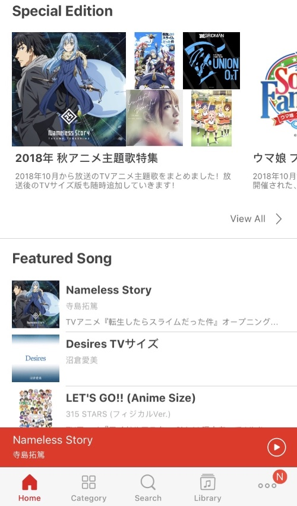
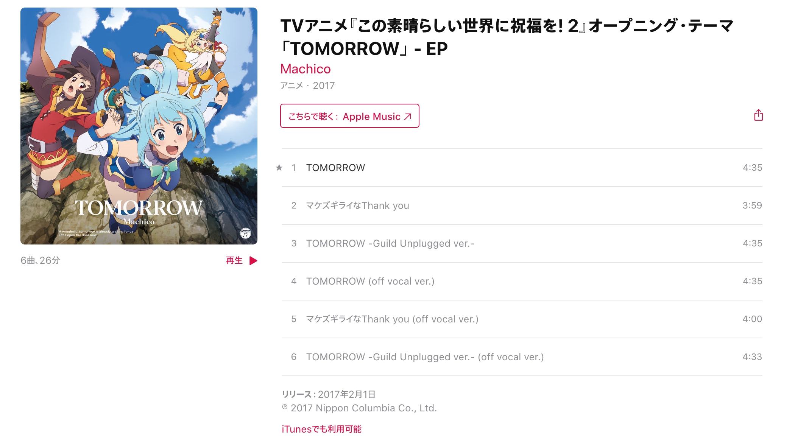
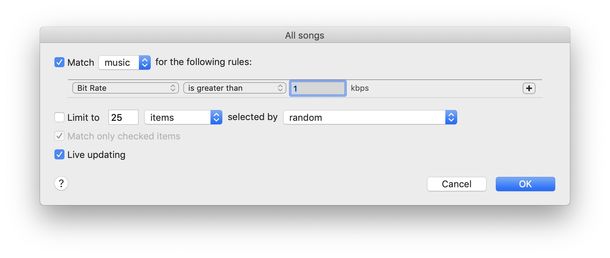
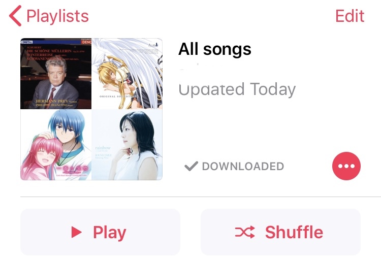
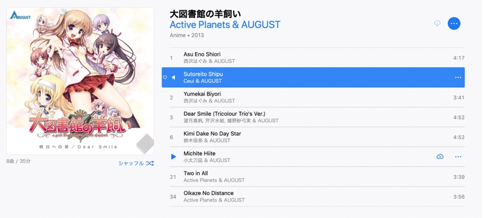
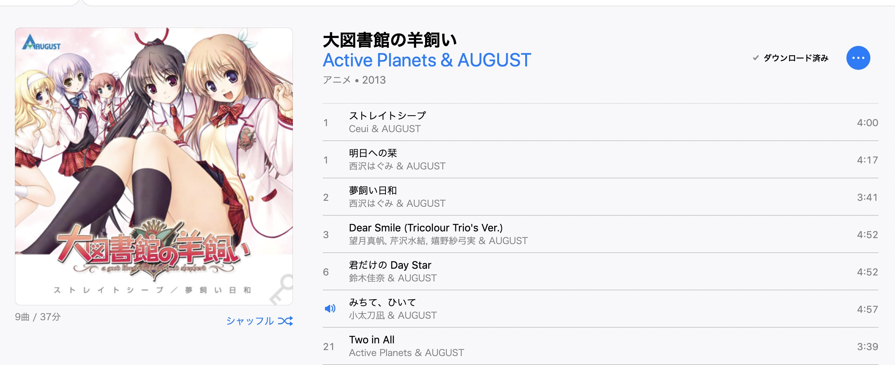
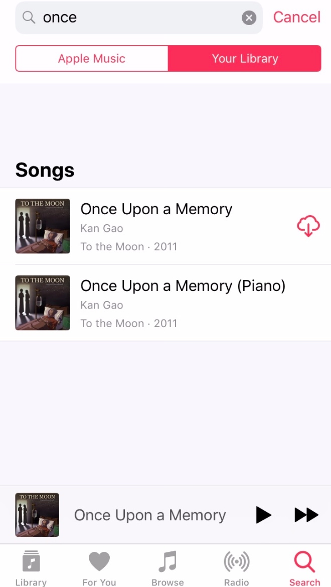

一直就有把手上所有的资源都实现全面正版化的打算，我决定从音乐资源开始入手，从我之前有限的体验来看，音乐资源的正版体验好像已经不错了，而且我的音乐收藏本身也是问题最多，最需要整理的资源。
<!--more-->
* toc
{:toc}

### 现存问题
* 音质：从最开始收集的不明来源的mp3（各种奇怪网站下载的版本）到后来的无损混杂在一起，让问题更混乱的是，移动设备上的音乐库是一个把所有资源都转成mp3的大杂烩，其中还有一部分资源被不可逆的转成了192k的版本（原版资源已不可考）
* 标签：经历过几次变迁，从最开始的把作品名写在文件名里到放在单独的文件夹里到用id3标签管理文件，作品名创作者名的版本五花八门，同一个作者可能被记为英文中文罗马音日语，导致检索的困难
* 备份：现在的做法是主音乐库放在RAID 1的NAS里，移动版音乐库放在手机上同步，但RAID 1能保证的可靠性也有限，同时也造成了移动设备上访问主音乐库的困难

因为这些问题，我放弃了对现有移动音乐库的维护，决定从零开始整理，收集到的资源以正版电子版为目标。

对于下一代音乐资源管理解决方案我的要求是：
* 音质有保证，没有"320k"和"无损"
* 可以很轻易的恢复（自动备份，云同步）
* 通过ID3标签管理文件，方便多种方式检索（同时这次全部用原文标注作品作者名，避免检索的困难）
* 避免成为正版的受害者，使用正版资源的体验必须接近甚至超越现有的体验
* 自带音乐订阅服务（不想为了听某些歌还要专门打开某个app）

### 尝试过的软件
####  网易云音乐

很方便，但我不得不放弃它
* 有"320k"和"无损"
* 哪些歌是有版权的版本哪些需要补票无法判断
* 海外ip以前可以买vip绕过海外版权限制，现在只能挂vpn
* 每次进app都要忍受几秒全屏广告(deal breaker)
* 稳定性存疑，经常因为版权问题大片灰掉某些歌，甚至有直接删歌的情况(deal breaker)
    
其他类似竞品的问题我猜也是类似的（只试用了一下虾米，版权问题，首屏广告etc），甚至可能比网易云更多？

####  ANiUTa

刚下载下来的前五分钟我以为这就是最终选择了：
* 动画按作品贴心的分类好曲目，还有每季新歌速递等实时更新的目录
* 正版，来源可靠
* 很多歌曲CD发售日就可以听到

但随后我就陷入了巨大的痛苦中，最终决定放弃它： 
* 不支持添加本地音乐，版权动画音乐很多，但是不全，意味着我需要再找一个其他应用管理ANiUTa没有的歌(deal breaker)
* “下载所有音乐/离线模式”在哪里？我没有找到，好像只能听一首下载一首
* app初一看还行，真的用起来发现bug奇多
    * ios11正式版出的时候没有第一时间适配导致无法正常使用
    * 加入歌曲到列表的功能随机不工作
    * 迷之随机卡顿
    * 其他小bug 
* 只对应iOS/Android，没有桌面版(deal breaker)
  
####  Spotify  
* [Spotify Connect](https://support.spotify.com/us/article/spotify-connect/)很方便
* 可以添加本地音乐
* anisong的版权歌曲虽然没ANiUTa那么多，但也有一定数量

但试用了一周我还是放弃了它
* 本地文件播放只能说支持了，但有局限
* iOS上打开Spotify经常要卡很长时间（5秒+），进去还要再卡一下(deal breaker)

####   iTunes+Apple Music
按照那篇著名的[2018年のApple Music、ANiUTa、Spotifyのアニソン聴き放題事情](blog.livedoor.jp/kumakazu1207/archives/51479392.html)的说法，其他类似的音乐订阅服务大概都是类似的，我也就懒得一个一个继续试了，直接对比了一些评测，我觉得iTunes+日区Apple Music可能是最好的选择
* 一站式音乐购买，管理
* iCloud Music Library可以上传并同步本地音乐，最多100,000首
* 和macOS/iOS原生结合，iOS应用可以秒开，macOS上可以很方便的用媒体键或者Alfred切歌，Apple Watch上可以很方便的播放手机的音乐
* Apple Music的西语和古典曲目也很充实（试探性的用软件匹配了一下我的相关曲目歌单，大概80%都能找到）
  
能想到的缺点是
* 购买的音乐一般最高只有256kbps AAC的版本
    * 但是都是DRM free的版本，如果将来需要迁移出iTunes也不会很困难
    * 玄学界好像普遍观点是和320kbps MP3接近甚至更高，就算以我目前最好的设备（HP-A8+AD1000PRM/A2000X）盲听也听不出无损和320kbps MP3的区别，所以256kbps AAC应该是够用了
* 过于深度的和系统绑定同时又是封闭的软件，可以预想如果出了bug会很麻烦
* 听说过iTunes音乐资料会突然消失的问题，但不打算把鸡蛋放在一个笼子里，自己购买的音乐会另外备份，iTunes也可以导出xml格式的播放列表，可以定期备份
* Apple Music需要日区信用卡，因为没有所以只能买gift card，汇率上会有点小亏，而且存在买到黑卡的隐患
* 偶尔会有切区买应用的需求，Apple ID一旦退出登录音乐会被清空，但这种需求不常见，而且现在的网速也很快，一会就能下载回来
  
  
经过比较，我最终选择了iTunes+Apple Music的方案

### 转移过程总结
iTunes有上传音乐并匹配Apple Music的功能，但我不打算用
* 不想用现在的杂乱的音乐收藏污染一个准备从零开始的新收藏库
* 匹配完了还得筛选没有匹配的版本（哪些是需要彻底删除再从iTunes购买的，哪些是之前买过cd需要重新抓并转换一个aac版本的，哪些是没有电子版需要上传的？）
* 是个好时机手动过一遍所有看过的动画和游戏的音乐

大概花了几个晚上整理完成
* 手动过了一遍所有音乐，有Apple Music版本的用AM版，没有就买iTunes版，都没有就上传本地的版本
* 看着以前自己收藏的音乐和写过的评论，有种和过去的自己对话的感觉:P
* 最后导出iTunes的播放列表xml看了一下，大约有40%来自Apple Music，30%来自上传，30%来自iTunes购买，来自Apple Music的音乐比例比我想的要高得多
* 30%上传里大概有10%是自购，也就是说转移后的正版率也只有80%，应该会接下来把该买的CD都买了（还有BD限定的曲目估计得买BD，可恶的商法）。黄油是重灾区，有很多我想着"这可是名作就算没上架Apple Music至少也有个电子版可买吧"的游戏毫无电子版痕迹，而且对这类歌来说，iTunes没上架电子版往往就意味着全网都找不到可以购买的电子版（极少数有dmm电子版）

同人音乐我还在头疼该怎么办呢，估计会更严重CD都不好找，这块其实基本没动

* 正版的体验实在是太爽了
    * 正版: 有没有Apple Music/iTunes版？有，点一下购买/加入自己的曲库就行，而且所有的标签信息都帮你填充好了。
    * 否则网上下载：来源不明的音乐是不能随便收的，那么得找靠谱的发布者的靠谱资源（无损，而且得是带自抓log以减少拿到"无损"的可能性，同时也就意味着要回复可见的帖子和花/赚论坛币等一堆麻烦事），下回来的cue文件编码还会不一样(SHIFT-JIS/GB18030/BIG5...)信息也不一定准，文本编辑器可以猜对一部分文件的编码，但是更多的需要自己一个个试文件的编码然后转换成自己需要的格式
    * 或者自己抓碟：需要配置EAC那一堆繁琐的设置，当然，还得转换成正确的音乐文件格式，然后自己填写音乐信息标签。而且iTunes可以分曲只购买自己想听的音乐，正版的CD可能得为了一两首想听的曲子把一整张碟子买下来，而且，只是个人的感受，我几乎没有实体收藏的执念，实体的CD对我来说更多的是累赘
* 一个猜测是，Apple可能去针对动画的主题歌谈过授权，可以看到有些专辑只能听动画相关的那一首歌

* 大概花了100,000yen，比想象中的少了很多
* 买到后期才想到，日区一首歌一般是200～250yen，美区一般是1.5美元，一小部分歌曲也有美区版，其实可以在美区买DRM free的版本再上传到日区的iCloud Music Library里
* 考虑到不可避免会有需要重新下载所有音乐的情况，而Apple又没有提供"一键下载所有音乐"的按键，我参考前人的经验建了一个Smart Play List用如下规则包括所有歌曲，然后只需要下载列表中的所有歌曲就行了

这个列表会被自动同步到手机，所以手机上也可以一键下载

* 踩到的坑1
    
    在iTunes上购入歌曲后，iTunes会"贴心"的帮你把歌曲名翻译成对应系统的语言，比如我是英语系统，歌曲是日语的，那么这首歌下载下来就成了罗马音。对于不会日语的用户来说这可能是个很方便的设定，但对我来说就头疼了，这让我以后怎么根据歌曲名搜歌...
    

    解决方法是如果只有一两首可以手动重命名。如果很多可以
    
    `$ open -n -a iTunes --args -AppleLanguages '("JA")'`
    
    指定iTunes用日语打开，删除错误命名的歌曲，然后去Store可以看到歌曲名都变成了日语，重新下载就好
    

* 踩到的坑2

    有几首歌买完之后反悔了决定退款，退款是在网页上上进行的，我天真的以为iOS和mac上的版本会被自动删除，结果Apple的做法是**本地删除音乐但在音乐列表里保留这首歌，然后显示为未下载**，但是一旦点击下载就会显示"你尚未购买此歌曲"，最后我只能退出账号再重新登陆并下载

     显示效果类似下图，看起来是"未下载"其实已经是"未购买"而且无法从本地歌单里删除这首歌
    

目前转移已经完成了两天，感觉良好，希望将来也不要出什么问题吧。

